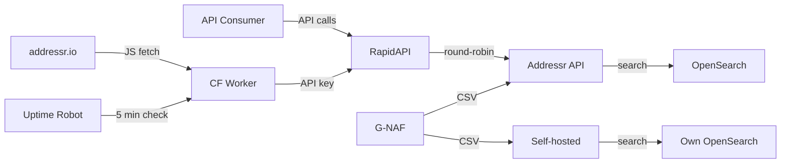
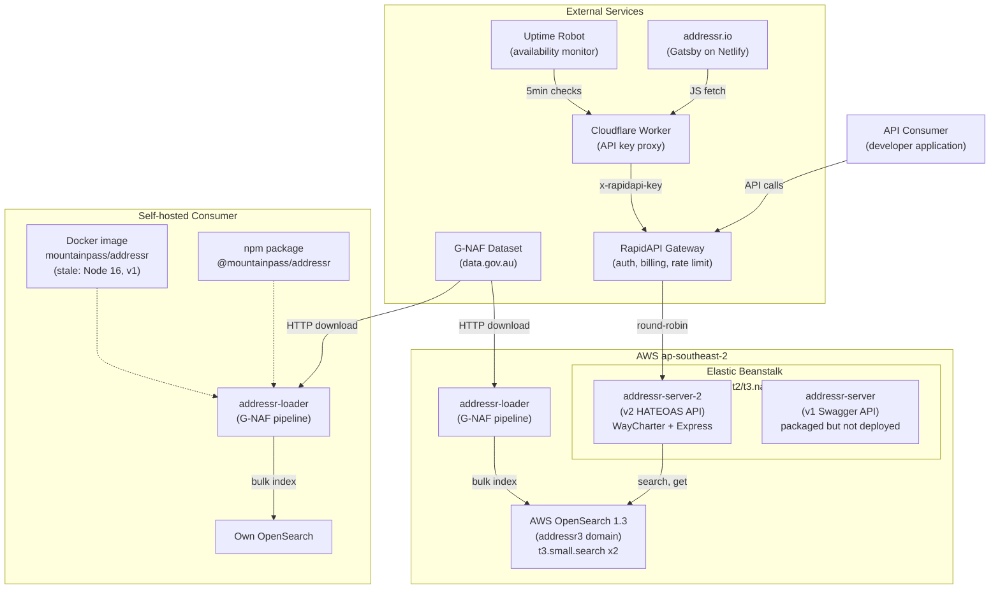
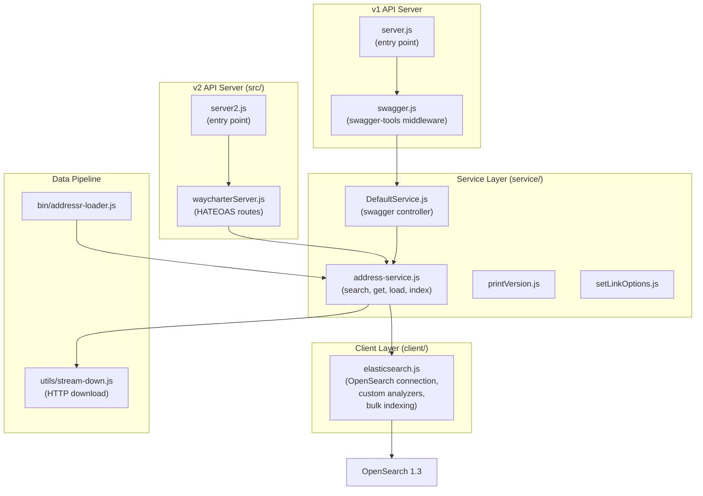
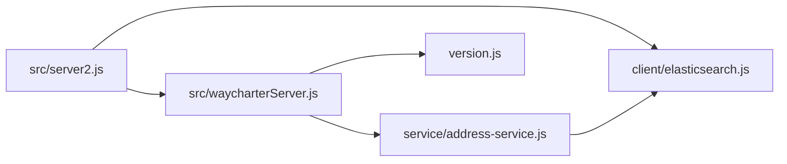
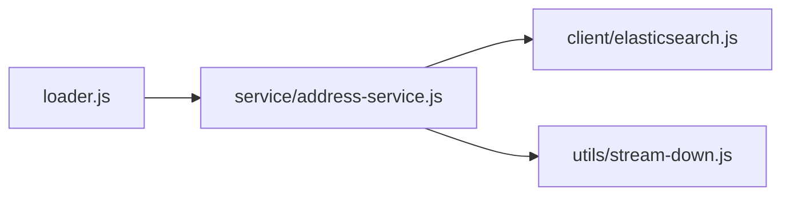
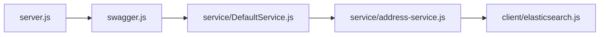

# C4 Architecture Model

This repo uses a hybrid C4 approach:
- C1/C2 are curated for intent and business context.
- C3/C4 are hand-curated (the C4 generator supports TypeScript only; addressr is JavaScript).

See ADRs 001-018 in `docs/decisions/` for the full decision context behind this architecture.

## C1: System Context

## C2: Container View

## C3: Component View

## C4: Code View

### v2 API (production path)

### Data Loader

### v1 API (packaged, not deployed)

