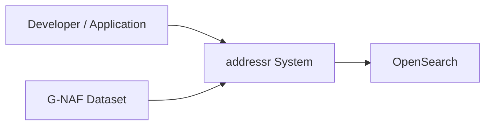
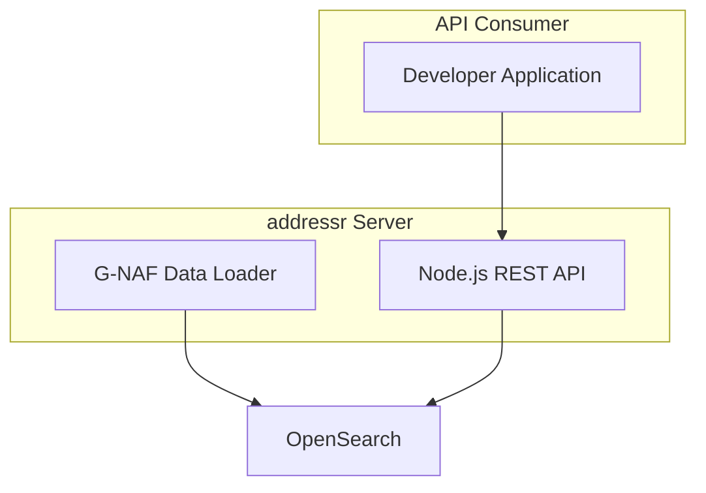

# C4 Architecture Model

This repo uses a hybrid C4 approach:
- C1/C2 are curated for intent and business context.
- C3/C4 are generated from code to reduce drift.

## C1: System Context

## C2: Container View

## C3: Component View (Generated)

<!-- c3:generated:start -->

TBD — regenerate with `/c4`

<!-- c3:generated:end -->

## C4: Code View (Generated)

<!-- c4:generated:start -->

TBD — regenerate with `/c4`

<!-- c4:generated:end -->

Regenerate: `/c4`

Check freshness: `/c4-check`
