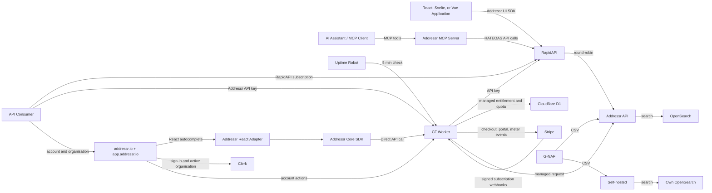
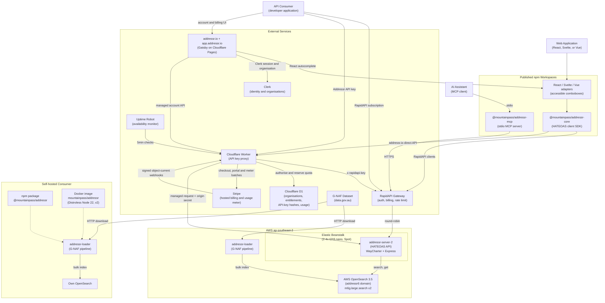
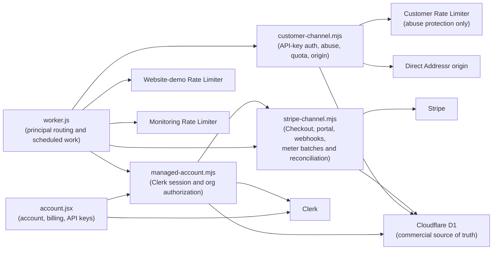
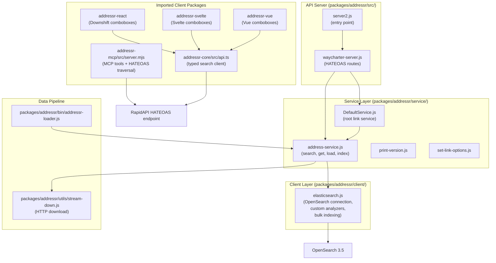
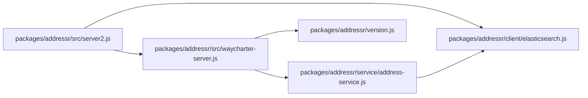
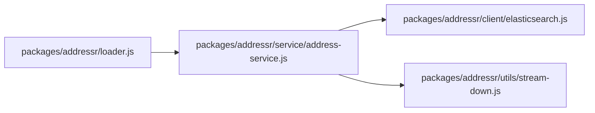
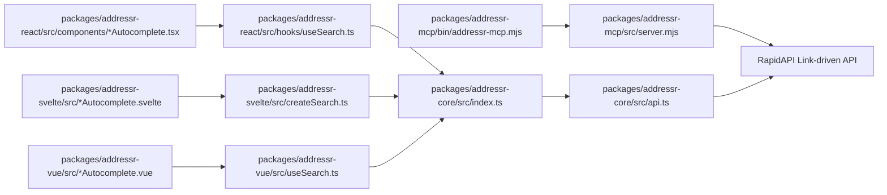

# C4 Architecture Model

This repo uses a hybrid C4 approach:

- C1/C2 are curated for intent and business context.
- C3/C4 are hand-curated (the C4 generator supports TypeScript only; addressr is JavaScript).

See `docs/decisions/README.md` for the decision context behind this architecture.

## C1: System Context

```mermaid
flowchart LR
  apiconsumer[API Consumer]
  mcpconsumer[AI Assistant / MCP Client]
  uiconsumer[React, Svelte, or Vue Application]
  website[addressr.io + app.addressr.io]
  uptimerobot[Uptime Robot]
  cfworker[CF Worker]
  d1[Cloudflare D1]
  clerk[Clerk]
  stripe[Stripe]
  rapidapi[RapidAPI]
  addressr[Addressr API]
  opensearch[OpenSearch]
  gnaf[G-NAF]
  selfhosted[Self-hosted]
  selfos[Own OpenSearch]

  apiconsumer -- RapidAPI subscription --> rapidapi
  apiconsumer -- Addressr API key --> cfworker
  apiconsumer -- account and organisation --> website
  mcpconsumer -- MCP tools --> addressrMcp[Addressr MCP Server]
  addressrMcp -- HATEOAS API calls --> rapidapi
  uiconsumer -- Addressr UI SDK --> rapidapi
  website -- React autocomplete --> addressrReact[Addressr React Adapter]
  addressrReact --> addressrCore[Addressr Core SDK]
  addressrCore -- Direct API call --> cfworker
  uptimerobot -- 5 min check --> cfworker
  cfworker -- API key --> rapidapi
  cfworker -- managed entitlement and quota --> d1
  website -- sign-in and active organisation --> clerk
  website -- account actions --> cfworker
  cfworker -- checkout, portal, meter events --> stripe
  stripe -- signed subscription webhooks --> cfworker
  cfworker -- managed request --> addressr
  rapidapi -- round-robin --> addressr
  addressr -- search --> opensearch
  gnaf -- CSV --> addressr
  gnaf -- CSV --> selfhosted
  selfhosted -- search --> selfos
```

## C2: Container View

```mermaid
flowchart TB
  apiconsumer["API Consumer<br/>(developer application)"]
  mcpconsumer["AI Assistant<br/>(MCP client)"]
  uiconsumer["Web Application<br/>(React, Svelte, or Vue)"]

  subgraph external["External Services"]
    rapidapi["RapidAPI Gateway<br/>(auth, billing, rate limit)"]
    cfworker["Cloudflare Worker<br/>(API key proxy)"]
    d1["Cloudflare D1<br/>(organisations, entitlements,<br/>API-key hashes, usage)"]
    uptimerobot["Uptime Robot<br/>(availability monitor)"]
    pages["addressr.io + app.addressr.io<br/>(Gatsby on Cloudflare Pages)"]
    clerk["Clerk<br/>(identity and organisations)"]
    stripe["Stripe<br/>(hosted billing and usage meter)"]
    gnaf["G-NAF Dataset<br/>(data.gov.au)"]
  end

  subgraph aws["AWS ap-southeast-2"]
    subgraph eb["Elastic Beanstalk<br/>(2-4x t2/t3.nano, Spot)"]
      v2api["addressr-server-2<br/>(HATEOAS API)<br/>WayCharter + Express"]
    end
    loader_aws["addressr-loader<br/>(G-NAF pipeline)"]
    opensearch["AWS OpenSearch 3.5<br/>(addressr6 domain)<br/>m6g.large.search x2"]
  end

  subgraph selfhost["Self-hosted Consumer"]
    npm["npm package<br/>@mountainpass/addressr"]
    docker["Docker image<br/>mountainpass/addressr<br/>(Distroless Node 22, v2)"]
    selfos["Own OpenSearch"]
    loader_self["addressr-loader<br/>(G-NAF pipeline)"]
  end

  subgraph sdk["Published npm Workspaces"]
    mcp["@mountainpass/addressr-mcp<br/>(stdio MCP server)"]
    core["@mountainpass/addressr-core<br/>(HATEOAS client SDK)"]
    adapters["React / Svelte / Vue adapters<br/>(accessible comboboxes)"]
  end

  apiconsumer -- RapidAPI subscription --> rapidapi
  apiconsumer -- Addressr API key --> cfworker
  apiconsumer -- account and billing UI --> pages
  mcpconsumer -- stdio --> mcp
  mcp -- HTTPS --> rapidapi
  uiconsumer --> adapters
  adapters --> core
  core -- RapidAPI clients --> rapidapi
  core -- addressr.io direct API --> cfworker
  pages -- React autocomplete --> adapters
  pages -- Clerk session and organisation --> clerk
  pages -- managed account API --> cfworker
  uptimerobot -- 5min checks --> cfworker
  cfworker -- x-rapidapi-key --> rapidapi
  cfworker -- authorise and reserve quota --> d1
  cfworker -- checkout, portal and meter batches --> stripe
  stripe -- signed object-current webhooks --> cfworker
  cfworker -- managed request + origin secret --> v2api
  rapidapi -- round-robin --> v2api
  v2api -- search, get --> opensearch
  loader_aws -- bulk index --> opensearch
  gnaf -- HTTP download --> loader_aws
  gnaf -- HTTP download --> loader_self
  loader_self -- bulk index --> selfos
  npm -.-> loader_self
  docker -.-> loader_self
```

## C3: Component View

### Managed customer channel

```mermaid
flowchart LR
  account["account.jsx<br/>(account, billing, API keys)"]
  managed["managed-account.mjs<br/>(Clerk session and org authorization)"]
  customer["customer-channel.mjs<br/>(API-key auth, abuse, quota, origin)"]
  stripeChannel["stripe-channel.mjs<br/>(Checkout, portal, webhooks,<br/>meter batches and reconciliation)"]
  worker["worker.js<br/>(principal routing and scheduled work)"]
  customerLimiter["Customer Rate Limiter<br/>(abuse protection only)"]
  demoLimiter["Website-demo Rate Limiter"]
  monitorLimiter["Monitoring Rate Limiter"]
  d1["Cloudflare D1<br/>(commercial source of truth)"]
  clerk[Clerk]
  stripe[Stripe]
  origin["Direct Addressr origin"]

  account --> clerk
  account --> managed
  worker --> managed
  worker --> customer
  worker --> stripeChannel
  worker --> demoLimiter
  worker --> monitorLimiter
  managed --> clerk
  managed --> d1
  managed --> stripeChannel
  customer --> customerLimiter
  customer --> d1
  customer --> origin
  stripeChannel --> stripe
  stripeChannel --> d1
```

```mermaid
flowchart TB
  subgraph api["API Server (packages/addressr/src/)"]
    server2["server2.js<br/>(entry point)"]
    waycharter["waycharter-server.js<br/>(HATEOAS routes)"]
  end

  subgraph service["Service Layer (packages/addressr/service/)"]
    addressService["address-service.js<br/>(search, get, load, index)"]
    defaultService["DefaultService.js<br/>(root link service)"]
    printVersion["print-version.js"]
    setLinkOptions["set-link-options.js"]
  end

  subgraph client["Client Layer (packages/addressr/client/)"]
    esClient["elasticsearch.js<br/>(OpenSearch connection,<br/>custom analyzers,<br/>bulk indexing)"]
  end

  subgraph data["Data Pipeline"]
    loaderBin["packages/addressr/bin/addressr-loader.js"]
    streamDown["packages/addressr/utils/stream-down.js<br/>(HTTP download)"]
  end

  opensearch["OpenSearch 3.5"]

  subgraph clients["Imported Client Packages"]
    mcpServer["addressr-mcp/src/server.mjs<br/>(MCP tools + HATEOAS traversal)"]
    coreSdk["addressr-core/src/api.ts<br/>(typed search client)"]
    reactAdapter["addressr-react<br/>(Downshift comboboxes)"]
    svelteAdapter["addressr-svelte<br/>(Svelte comboboxes)"]
    vueAdapter["addressr-vue<br/>(Vue comboboxes)"]
  end

  rapidapi["RapidAPI HATEOAS endpoint"]

  server2 --> waycharter
  waycharter --> addressService
  waycharter --> defaultService
  defaultService --> addressService
  addressService --> esClient
  loaderBin --> addressService
  addressService --> streamDown
  esClient --> opensearch
  mcpServer --> rapidapi
  coreSdk --> rapidapi
  reactAdapter --> coreSdk
  svelteAdapter --> coreSdk
  vueAdapter --> coreSdk
```

## C4: Code View

### API (production path)

```mermaid
flowchart LR
  server2["packages/addressr/src/server2.js"]
  waycharter["packages/addressr/src/waycharter-server.js"]
  addressSvc["packages/addressr/service/address-service.js"]
  esClient["packages/addressr/client/elasticsearch.js"]
  version["packages/addressr/version.js"]

  server2 --> waycharter
  server2 --> esClient
  waycharter --> addressSvc
  waycharter --> version
  addressSvc --> esClient
```

### Data Loader

```mermaid
flowchart LR
  loader["packages/addressr/loader.js"]
  addressSvc["packages/addressr/service/address-service.js"]
  esClient["packages/addressr/client/elasticsearch.js"]
  streamDown["packages/addressr/utils/stream-down.js"]

  loader --> addressSvc
  addressSvc --> esClient
  addressSvc --> streamDown
```

### MCP and UI packages

```mermaid
flowchart LR
  mcpBin["packages/addressr-mcp/bin/addressr-mcp.mjs"] --> mcpServer["packages/addressr-mcp/src/server.mjs"]
  mcpServer --> rapidapi["RapidAPI Link-driven API"]

  coreIndex["packages/addressr-core/src/index.ts"] --> coreApi["packages/addressr-core/src/api.ts"]
  coreApi --> rapidapi

  reactHooks["packages/addressr-react/src/hooks/useSearch.ts"] --> coreIndex
  reactComponents["packages/addressr-react/src/components/*Autocomplete.tsx"] --> reactHooks
  svelteStores["packages/addressr-svelte/src/createSearch.ts"] --> coreIndex
  svelteComponents["packages/addressr-svelte/src/*Autocomplete.svelte"] --> svelteStores
  vueComposables["packages/addressr-vue/src/useSearch.ts"] --> coreIndex
  vueComponents["packages/addressr-vue/src/*Autocomplete.vue"] --> vueComposables
```
